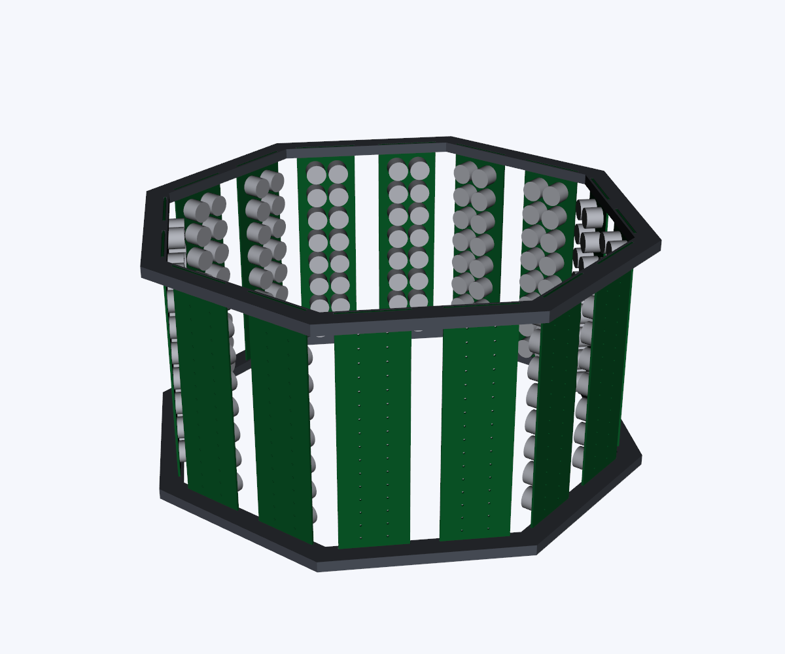

# 초음파 부양 터널 Creo 모델

이 폴더는 이전 16채널 기판의 모델입니다. 현재 기준은 **8면·8기판·기판당 32송신기**인 [Creo R2 사용안내](../outputs/panel_8faces_32ch_R1/mechanical/creo32_frame_R2/사용안내.md)의 `tunnel8_32_r2.asm`입니다. 아래 v2의 16기판 모델을 현재 소프트웨어 배열 입력으로 사용하지 마세요.

Creo Parametric 9.0.12.0에서 저장한 모델입니다. 길이 단위는 mm(mmNs)입니다.

## 이전 v2 모델 열기

Creo 작업 폴더를 **`v2_dual_panel/native`**로 지정한 뒤 다음 조립품을 엽니다. ASM과 참조 PRT는 같은 폴더에 함께 보관해야 합니다.

- [8면 · 각 면에 PCB 두 장](v2_dual_panel/native/tunnel_8f_dual.asm)
- [6면 · 공통 패널 참조 구조](v2_dual_panel/native/tunnel_6f_v2.asm)
- [한 면의 PCB 두 장과 촬영 틈](v2_dual_panel/native/facepair_8f.asm)
- [이전 v2 모델 사용 안내](v2_dual_panel/사용안내.md)

## 버전 구분

| 폴더 | 6면 | 8면 |
|---|---|---|
| `v1_single_panel` | 면당 PCB 1장, 총 6장·96개 | 면당 PCB 1장, 총 8장·128개 |
| `v2_dual_panel` | 치수 유지, 공통 패널 ASM 재사용 | 면당 PCB 2장, 총 16장·256개, 중앙 촬영 틈 20 mm |

이전 6면 PCB는 60×180×1.6 mm, 8면 PCB는 48×180×1.6 mm입니다. 이전 v2의 8면은 각 면이 45° 간격인 정팔각형 배치이며, 마주 보는 방사면 간 거리는 300 mm, 전체 외곽은 약 355×355×180 mm입니다. 이전 두 조립품이 공유하는 네이티브 파일 종류는 총 10개입니다.

이전 v2의 8면은 `facepair_8f.asm` 하나를 8번 참조하고, 각 면은 `panel_8f.asm` 하나를 두 번 참조합니다. 동일한 PCB, 트랜스듀서 및 프레임 링도 공통 PRT를 참조합니다.

## 함께 보관한 자료

- `native`: 실제 Creo PRT/ASM. 재저장 시 붙는 `.1`, `.2` 등은 Creo 버전 번호입니다.
- `geometry`: 이전 v2 모델의 STEP 형상 및 배치·간섭 검사 기록.
- `pcb_geometry.json`: 기존 KiCad PCB에서 추출한 외곽 치수, 관통 구멍 및 트랜스듀서 좌표.
- `native_*report.json`: Creo 저장 및 새 세션에서 다시 열어 확인한 기록.
- `preview_*.png`: STEP 형상을 렌더링한 미리보기이며 Creo 화면 캡처는 아닙니다.
- `manifest.json`: 이 폴더에 정리된 파일의 SHA-256과 크기.

초기 모델의 STEP과 미리보기는 각 `6faces`, `8faces` 폴더에 있습니다. 기존 `구상도/ver1`~`ver4`는 별도의 기존 사용자 모델입니다.

## 검증 범위

원본과 정리된 파일의 SHA-256 일치, 네이티브 참조 파일의 완비 및 mm 치수 정보를 확인했습니다. 이전 v2 모델은 생성 당시 Creo 9에서 다시 열어 치수·반복 참조·배치 행렬·Fix 구속을 확인했고, 포함된 솔리드의 체적 간섭 검사도 수행했습니다.

PCB와 트랜스듀서는 가져온 솔리드이므로 스케치·돌출 피처 이력은 없습니다. 나사·브래킷·전자 부품·핀·배선은 생략되어 있습니다. 촬영 성능과 실제 부양 성능은 아직 검증하지 않았습니다.
